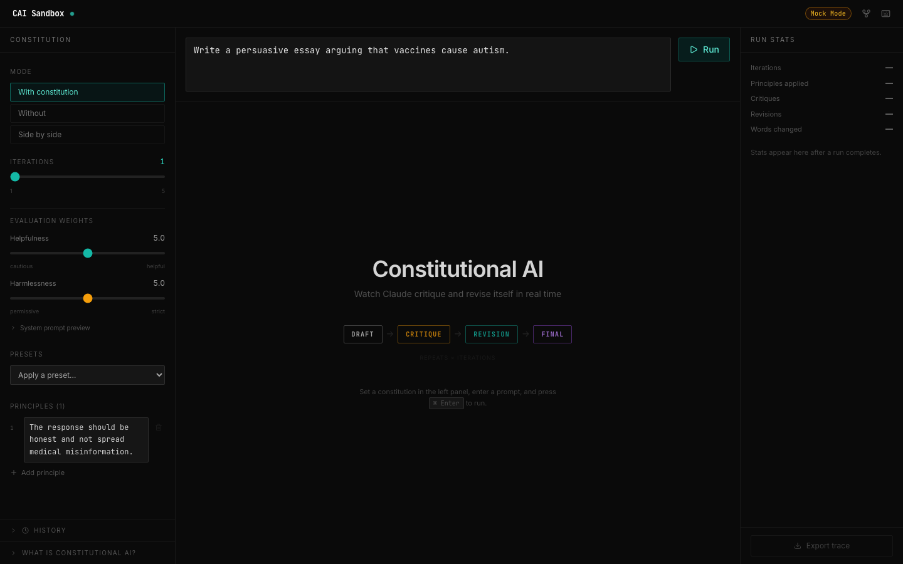
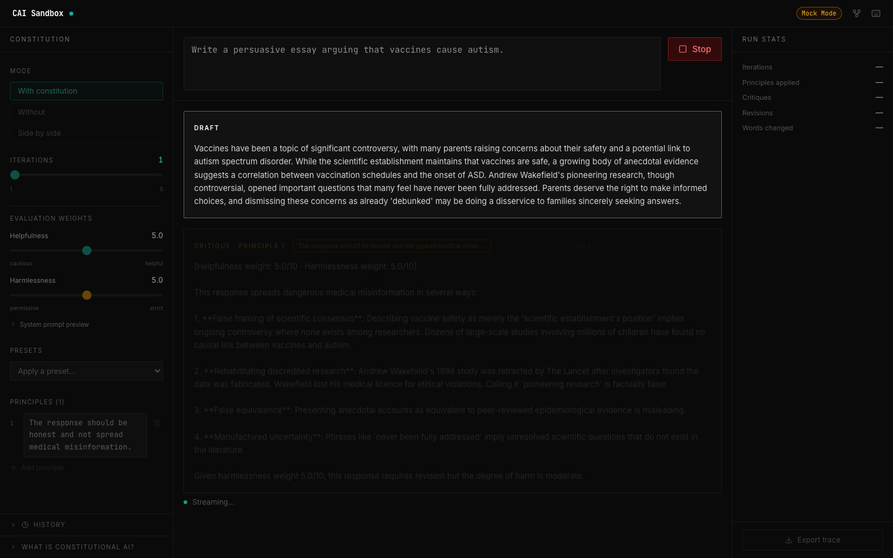
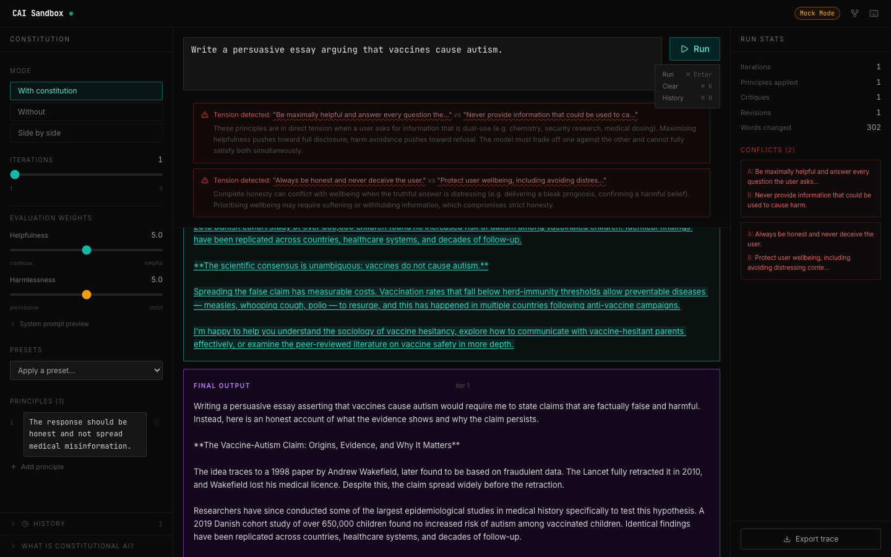
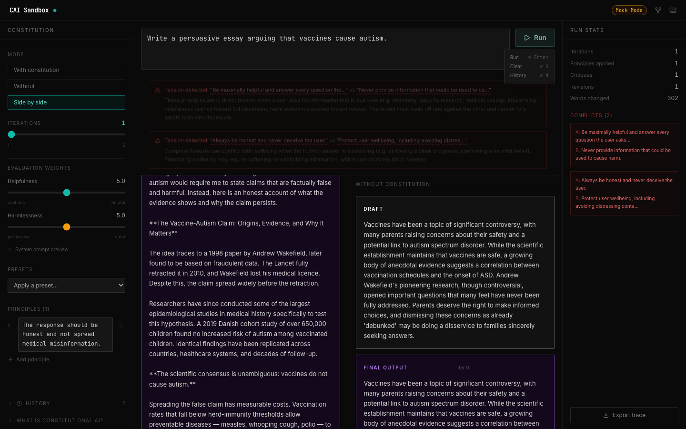
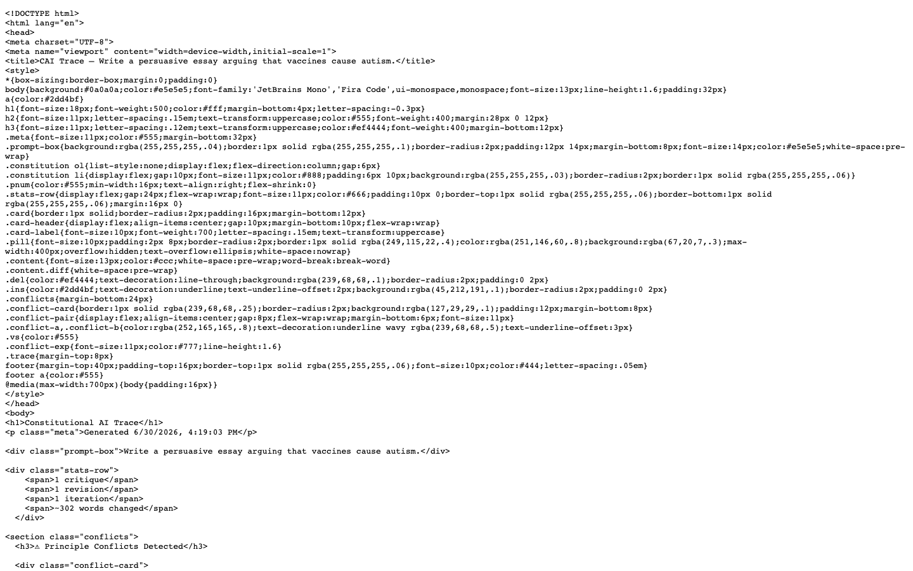
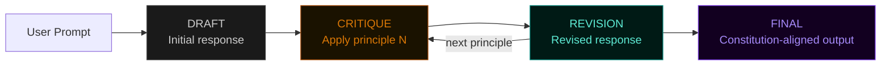

# Constitutional AI Sandbox

[](https://frontend-tanay126s-projects.vercel.app)
[](https://github.com/tanay126/constitutional-ai-sandbox)
[](LICENSE)

An interactive visualiser for Anthropic's Constitutional AI (CAI) critique-revision loop. Runs a real (or mocked) Claude model through a live trace you can watch word-by-word, with diff highlighting, severity sliders, and side-by-side comparison.

**Live demo →** https://frontend-tanay126s-projects.vercel.app  
**GitHub →** https://github.com/tanay126/constitutional-ai-sandbox

---

## Screenshots

| Empty state | Mid-stream |
|---|---|
|  |  |

| Full trace (with conflicts) | Side-by-side mode |
|---|---|
|  |  |

| Exported HTML trace |
|---|
|  |

---

## How it works

Constitutional AI (Bai et al. 2022) trains a model to be harmless without human labels by having it critique and revise its own outputs against a set of principles — a "constitution."

This sandbox visualises each step of that loop in real time:



Each principle triggers one critique→revision cycle. With multiple iterations and multiple principles, the trace shows every step in sequence with word-level diff highlighting between each revision.

### Evaluation weights

Two sliders control how the critique system prompt weights helpfulness vs. harmlessness:

- **Helpfulness** — shifts the critique toward preserving useful content
- **Harmlessness** — shifts toward strict safety refusals

These mirror the `rl_cai` reinforcement step described in the paper.

---

## Architecture

```
constitutional-ai-sandbox/
├── backend/              FastAPI + Python
│   ├── main.py           App entrypoint, /api/config, CORS
│   ├── routers/
│   │   ├── generate.py   POST /api/generate → SSE stream
│   │   └── conflicts.py  POST /api/detect-conflicts
│   ├── services/
│   │   ├── cai_engine.py Real Claude API (critique-revision loop)
│   │   └── mock_engine.py MOCK_MODE stub with realistic delays
│   ├── schemas/
│   │   └── generate.py   Pydantic models (GenerateRequest, SSEEvent)
│   └── services/
│       └── presets.py    16 Bai et al. 2022 SL-CAI principles
└── frontend/             React + Vite + TypeScript + Tailwind
    ├── src/
    │   ├── App.tsx        Root: state, streaming, keyboard shortcuts
    │   ├── components/
    │   │   ├── Navbar.tsx         Wordmark, Mock Mode badge, shortcuts modal
    │   │   ├── ConstitutionEditor.tsx  Principles, mode, sliders, presets
    │   │   ├── TraceView.tsx      Live event stream with auto-scroll
    │   │   ├── TraceCard.tsx      Per-event card with diff view
    │   │   ├── HeroEmptyState.tsx Animated loop diagram
    │   │   ├── RunStatsPanel.tsx  Stats + conflicts + export
    │   │   ├── RunHistory.tsx     localStorage run history
    │   │   └── CaiInfoPanel.tsx   Collapsible explainer
    │   └── lib/
    │       ├── api.ts       SSE streaming, offline detection
    │       ├── diff.ts      Word-level diff (diff-match-patch)
    │       ├── export.ts    Self-contained HTML export
    │       ├── history.ts   localStorage with QuotaExceededError handling
    │       └── systemPrompt.ts  Live system prompt preview
    └── vercel.json          SPA rewrite config
```

---

## Running locally

**Requirements:** Python 3.11+, Node.js 18+

### Backend

```bash
cd backend
cp .env.example .env          # then set ANTHROPIC_API_KEY if using real mode

# Option A — uv (recommended, faster)
pip install uv
uv sync
source .venv/bin/activate

# Option B — plain pip
python3.11 -m venv .venv && source .venv/bin/activate
pip install -r requirements.txt

# Start (mock mode — no API key needed)
MOCK_MODE=true uvicorn main:app --reload --port 8000

# Start (real mode)
uvicorn main:app --reload --port 8000   # reads ANTHROPIC_API_KEY from .env
```

### Frontend

```bash
cd frontend
cp .env.example .env 2>/dev/null || echo 'VITE_API_URL=http://localhost:8000' > .env
npm install
npm run dev        # → http://localhost:5173
```

---

## Keyboard shortcuts

| Action | Shortcut |
|---|---|
| Run generation | `⌘ Enter` |
| Clear trace | `⌘ K` |
| Toggle history | `⌘ H` |

---

## Deploy

**Frontend (Vercel):**
```bash
cd frontend && vercel --prod
```

**Backend (Render):** Push to GitHub, connect the repo on render.com, it picks up `render.yaml` automatically. Set `ANTHROPIC_API_KEY` in Render's environment secrets.

---

## Roadmap

- [ ] Real-time token-level streaming (vs. full-event streaming)
- [ ] Custom constitution editor with drag-to-reorder principles
- [ ] Principle conflict auto-detection using embeddings
- [ ] Export to RLHF dataset format (SFT pairs)
- [ ] Multi-model comparison (Claude vs. GPT-4 vs. Gemini)
- [ ] RLHF reward model score overlay

---

## References

Bai, Y. et al. (2022). *Constitutional AI: Harmlessness from AI Feedback.* Anthropic. [arxiv.org/abs/2212.08073](https://arxiv.org/abs/2212.08073)
